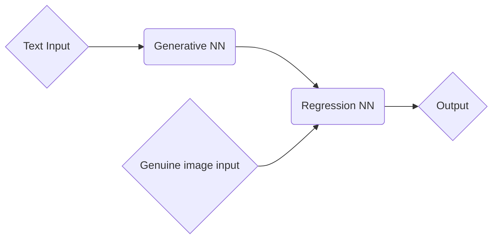

# Image genarating Convolutional Neural Network

In this project I created a convolutional network to generate images from a text input. The network is
 trained by training another network to tell whether the image looks real.

# Dependencies
 - Python 3.6+

 Tested on
 - Ubuntu 18.04
 - Python 3.8.13
 - Tensorflow 2.8.0
 - CUDA 11

# Dataset
 This project uses a program to scrape images from Pixabay.com

# Usage

# Principle

Both of the neural networks are being trained at once, the Regression NN to tell apart the generated Image and the genuine image from the dataset.